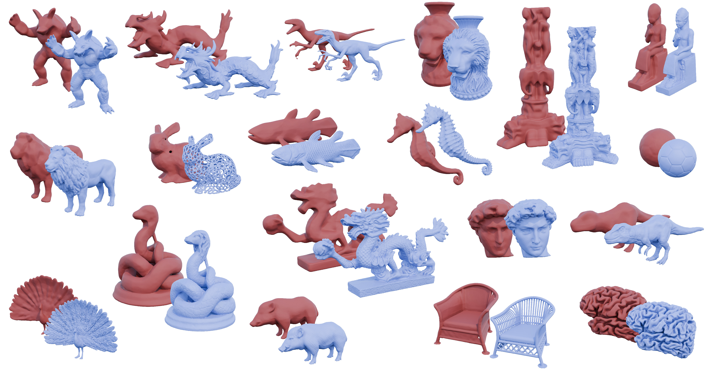

# RBF Detail field for neural implicit surfaces

This repository contains the code accompanying our SGP 2026 publication:
_Compactly supported detail field for high quality neural implicit surfaces_, Guillaume Coiffier & Justine Basselin.



Project page: [https://gcoiffier.github.io/publications/neural_detail_field/](https://gcoiffier.github.io/publications/neural_detail_field/)  
Paper pdf: [https://inria.hal.science/hal-05716801v1](https://inria.hal.science/hal-05716801v1)

# Installation / Environment setup

First clone the repository and create a python virtual environment:

```bash
git clone https://github.com/GCoiffier/neural-sdf-detail-field.git
cd neural-sdf-detail-field
python -m venv inrdf
source inrdf/bin/activate
```

Then install the dependencies:
```bash
pip install -r requirements.txt
```

This code has been tested on a Ubuntu 24.04 with python 3.12, pytorch 2.11 and cuda 13.0

## Finding input data

Some sample data can be found in the `inputs` folder. Other input meshes used in this project can be downloaded from:

- The Stanford 3D Scanning Repository: [https://graphics.stanford.edu/data/3Dscanrep/](https://graphics.stanford.edu/data/3Dscanrep/)
- [https://threedscans.com/](https://threedscans.com/)
- Designs from user YahooJapan on thingiverse: [https://www.thingiverse.com/YahooJAPAN/designs](https://www.thingiverse.com/YahooJAPAN/designs)
- Thingi10k: [https://ten-thousand-models.appspot.com/](https://ten-thousand-models.appspot.com/)

Our code supports input in the form of `.stl`, `.obj`, `.ply`, `.mesh` and `.geogram_ascii` files. Output meshes are given as `.obj` file while debug meshes are given as `.geogram_ascii` files, which are meant to be read by the [GraphiteThree](https://github.com/BrunoLevy/GraphiteThree) software.

# Running the code

Running our code consists of two main parts:
### 1. Train a neural implicit to approximate the signed distance field of the input geometry

```bash
python train_hkr.py <path/to/input/mesh>
```

This trains a 1-Lipschitz neural network minimizing the hinge-Kantorovitch-Rubinstein loss as in [1]. The output will be written in a new folder named `output/<geometry_name>/hkr`. Output meshes are given as wavefront .obj files. Run with the `-h` flag to see all commandline parameters and arguments.

### 2. Compute a RBF field to correct this neural field to better account for surface details

Once a neural field has been trained onto the input geometry, a detail field can be computed using this command:

```bash
python compute_detail_field.py output/<geometry_name>/hkr -nc 100000 -res 400
```

where the first argument is the folder created by the previous script that contains all of the output files. The `-nc` argument specifies the number of basis functions to consider. Typical values range from 100k to 500k. The `-res` argument specifies the resolution of the final marching cube extraction (400 is usually enough). Run the `-h` flag for help about all commandline arguments.

# Comparisons and additional experiments


## Experiments
We provide three scripts in the `experiments` folder that are meant to reproduce results from the paper.

### Variable RBF support size (Figure 3)
```bash
python train_hkr.py inputs/gargoyle.obj
python experiments/support_size.py output/gargoyle/hkr
```

### Partial detail field (Figure 6)
```bash
python train_hkr.py inputs/grayloc.obj
python experiments/partial_detail_field.py
```

### Changing the RBF kernel function
```bash
python train_hkr.py inputs/armadillo.obj
python experiments/rbf_shape.py
```


## Comparisons with previous works
We provide re-implementation of various previous works on neural distance fields for comparison. These can be substituted to the 1-Lip training.
Technically, a RBF detail field can then be computed for all of these models, but it is usually not needed.

### Hotspot [2]
```bash
python train_hotspot.py <path/to/input/mesh>
```

### Siren Network [3]
```bash
python train_implicit_surface.py <path/to/input/mesh> --architecture SIREN
```

### Random Fourier Features [4]
```bash
python train_implicit_surface.py <path/to/input/mesh> --architecture RFF --layer-size 256 --n-layers 10
```

### Implicit Displacement field [5]
```bash
python train_idf.py <path/to/input/mesh>
```


# References

[1] _1-Lipschitz Neural Distance Fields_, G.Coiffier & L.Béthune (2024),
https://arxiv.org/abs/2407.09505

[2] _HotSpot: Signed Distance Function Optimization with an Asymptotically Sufficient Condition_, Z. Wang et. al (2025)
https://arxiv.org/abs/2411.14628, https://github.com/Galaxeaaa/HotSpot

[3] _Implicit Neural Representations with Periodic Activation Functions_, Sitzmann et al., 2020
https://arxiv.org/abs/2006.09661

[4] _Fourier Features Let Networks Learn High Frequency Functions in Low Dimensional Domains_, M. Tancik et al. (2020)
https://arxiv.org/abs/2006.10739

[5] _Geometry-Consistent Neural Shape Representation with Implicit Displacement Fields_, W. Yifan et al. (2022)
https://openreview.net/forum?id=yhCp5RcZD7, https://github.com/yifita/idf
